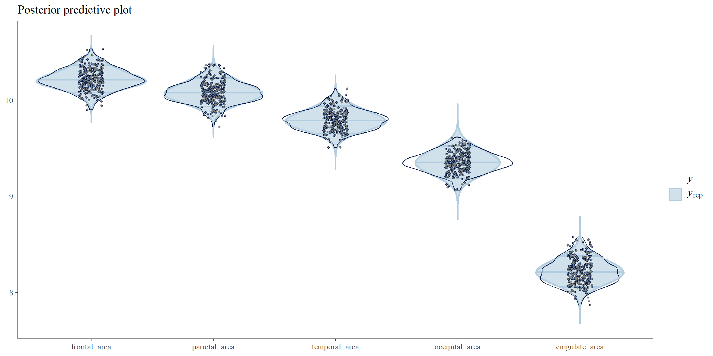
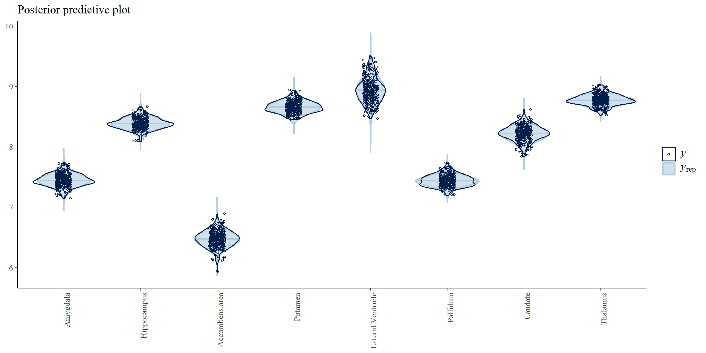
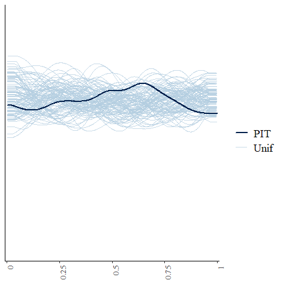
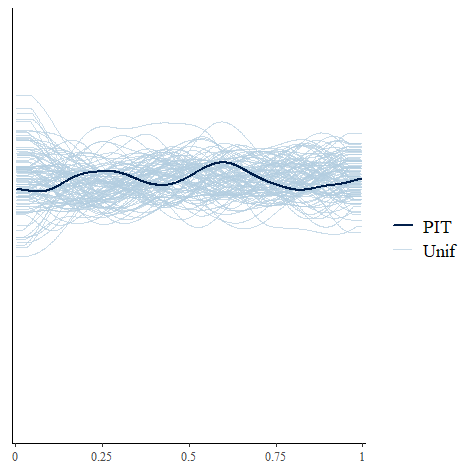
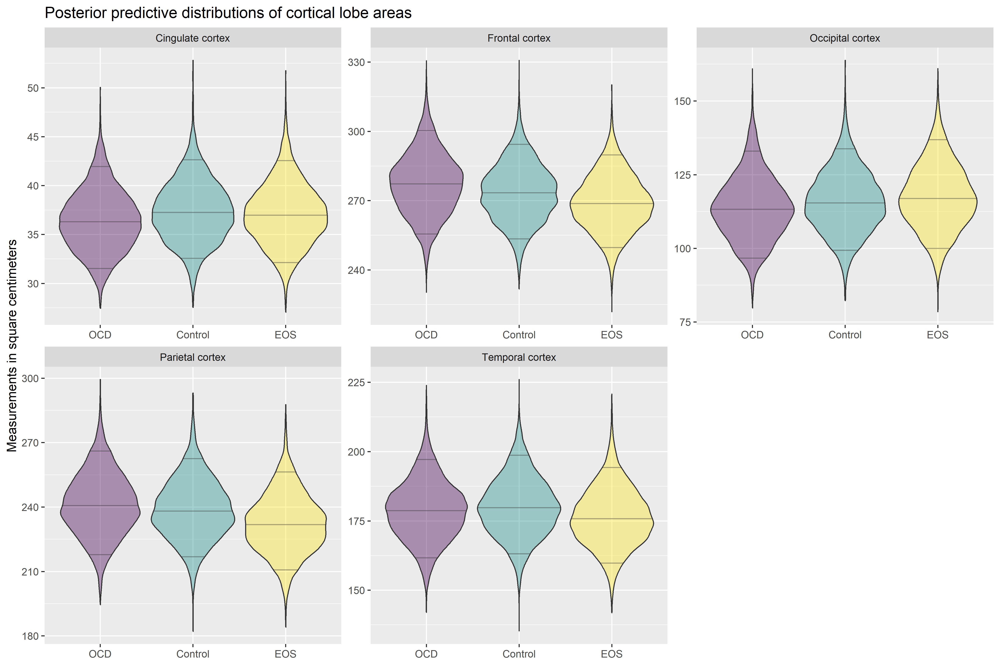
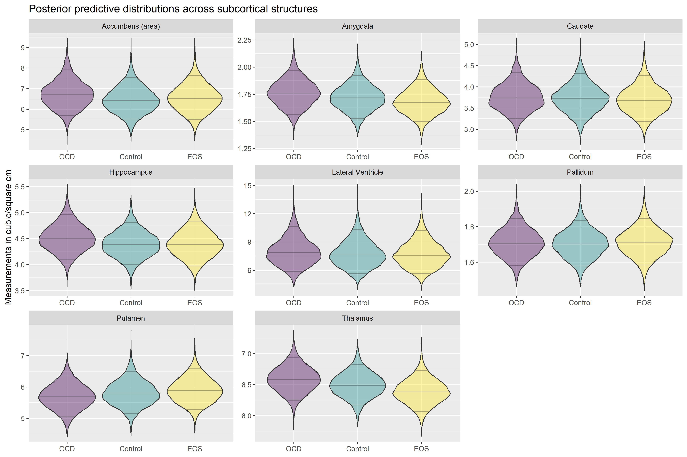

Supplementary material for the poster: “EOS and OCD - different brain
signatures are noted though overlapping features exist”
================
Nor C. Torp, Erling W. Rognli, Stener Nerland, Runar E. Smelror, Tord
Ivarsson & Ingrid Agartz
2025-06-28

## Prior distributions in the model

We generally use weakly informative priors in this model. These are
priors that rule out a priori implausible regions of the parameter
space, but that otherwise are quite wide and not informative about
directions of effects or such. The model is also specified with
hierarchical priors on the effects of EOS, OCD, age and female gender.
The coefficients for the various brain regions are given a joint normal
prior, with the mean and variance of those priors constituting
hyperparameters of the model. These are in turn given priors
(hyperpriors). The advantage of this is that even though we may not have
prior knowledge of the direction and magnitude of effects per region, we
can usually say something about a reasonable range of effect sizes.

### Priors on regression coefficients

For the means of the coefficients for EOS, OCD, age and female gender
across brain structures, we set normal priors with a mean of 0 and
standard deviation of 0.5. This encodes an assumption that the average
multiplicative effect of these variables on cortical area or subcortical
volume is between .37 and 2.66 with 95% certainty, and that the most
likely average multiplicative effect is 1 (i.e. no effect at all).

For the standard deviations of the coefficients for EOS, OCD, age and
female gender across brain structures we set a lognormal prior with mean
-1 and standard deviation 1. This encodes an assumption that the average
multiplicative deviation of effects across structures is not likely to
be zero, but not larger than 7 - which is hardly a strong assumption.

### Priors on participant random effects and intracranial volume

As the model contains measurements across the hemispheres nested within
structures, then nested within participants, we need to model subject
level random effects. At the same time, intracranial volume is often
used to adjust analyses, to account for differences in brain region size
due to differences in head size alone. We therefore regress the
participant random effects on standardized intracranial volume, in
practice informing the random effects per participant by the
measurements of intracranial volume, while allowing the error
distribution of the regression to capture the rest of the distribution
of participant random effects. We set a Normal(0, 0.5) distribution on
the regression coefficient and a Half-normal(0, .25) distribution on the
errors. The latter implies an assumption that the average multiplicative
deviation from the expectation for a subject random effect, conditional
on intracranial volume is within 1.6.

### Priors on brain region random effects

We also need to model the differences between brain regions. The model
has an overall intercept, and the regionwise random effects are then
given a sum-to-zero constraint, to avoid unidentifiability. The overall
intercept is scaled differently for area and volume. We set a quite wide
prior on the regionwise random effects, with a Half-Normal(0, .8)
distribution. This assumes that the average multiplicative deviation
from the overall intercept is within 5. A multiplier is also applied to
the variance of these, due to the sum-to-zero constraint (as shown in
code by Sean Pinkney, with reference to “Fraser, D. A. S. (1951). Normal
Samples With Linear Constraints and Given Variances. Canadian Journal of
Mathematics, 3, 363–366. <doi:10.4153/CJM-1951-041-9>”.)

### Error distributions

The model is fitted with separate error variances for each structure.
These are all given Half-Normal(0,1) priors, assuming that its unlikely
that any observation will be more than 7 times larger or smaller than
predicted, which is again not a particularly strong assumption given the
overall model.

## Posterior predictive checking

To evaluate model fit, we can use posterior predictive checking. If the
model fits the data well, it should be able to predict the outcome
variable from the predictor variables and the fitted model parameters
with reasonable accuracy. We can evaluate this by making repeated draws
of the predicted distribution of the outcome variable given the
predictor variables and the fitted model, and then plotting these
against the observed outcome variable that was used to fit the model in
the first place. Model fit can then be evaluated directly from the
similarity of the distributions.

Here we have made violin plots for this purpose, using the excellent
*bayesplot* package. The blue, shaded distributions are plotted from
4000 draws of the outcome variable predicted by the model, while the
dots and the violin is the observed distribution. We plot the various
brain regions separately. Note that the scale on the y-axis is the log
of the cortical area. 

And similarly, we make the same type of plot for subcortical volumes:

As is evident from the plots, the model fits reasonably well.

Another form of posterior predictive checking available in *bayesplot*
is the loo-pit plot. This uses approximate leave-one-out
cross-validation (through the very convenient *loo* package) and the
probability integral transform, calculating the cumulative probability
density of each observation when left out of fitting the model. With a
calibrated model, these follow a uniform distribution between 0 and 1
(see bayesplot documentation for references). The following plot
compares the distribution of these loo-pit values to repeated draws from
a uniform 0-1 distribution. Deviations from the uniform distribution can
be used to diagnose unmodelled under- or overdispersion, or bias.

The loo-pit plot for the model for cortical areas:

And for the model for subcortical volumes:

Both also indicating adequate model fit.

## Posterior Predictive Distributions

Looking at coefficient estimates in isolation is not always a good way
of understanding the implications of a fitted model. However, given any
set of predictor variables we choose, we can use the joint posterior
distribution to draw the implied distribution of the modelled variable.
This is called the posterior predictive distribution - the predicted
distribution of the outcome variable conditional on the fitted model and
the chosen set of predictor variable values. Plotting the posterior
predictive distributions is particularly illustrative.

Here we plot the posterior predictive distributions for EOS, OCD and
Controls separately. When simulating these distributions we have used
the proportion of females in the sample as the predictor value for
female gender, and the sample mean of age as the predictor value for
age. We have omitted the random intercepts per participants, as these
were based on the mean-centered values of intracranial volume. These
plots can hence be interpreted as the distribution of areas or volumes
for new controls, EOS-patients and OCD-patients, of indeterminate age
and gender.

As they are based on the posterior distribution, and not on point
estimates, these plots contain both the modelled variability (the
residual variance of the model) and the statistical uncertainty of all
the estimates.

[Return to main page](http://github.com/erlingrognli/mrs)
